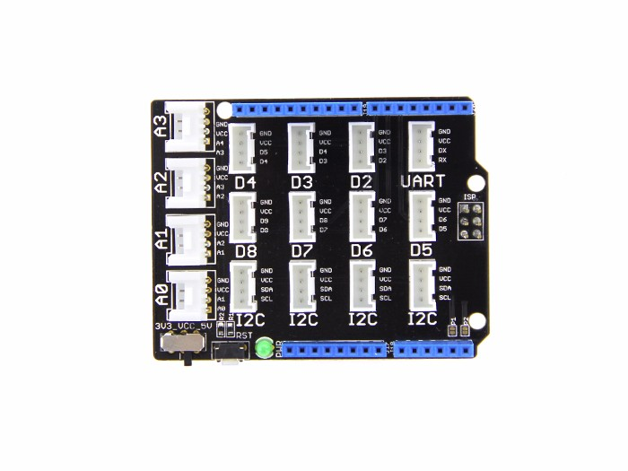

Using a Grove shield for most of the connections but not all of the digital pins are broken out.

Not using TX and RX so can use pin 0 and 1 for the lights

# Lights
* Headlights - Pin 1
* Brakes  lights - Pin 2
* Indicator L - Pin 3
* Indicator R - Pin 4

#Motor
* Motor Spped - Pin 5
* Motor 1 Direction - Pin 6,7
* Motor 2 Direction - Pin 7,8

#Bumpers
* A0
